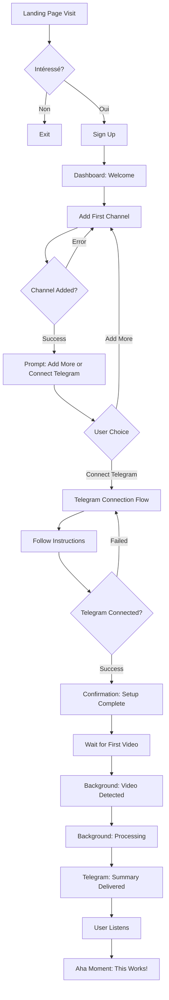
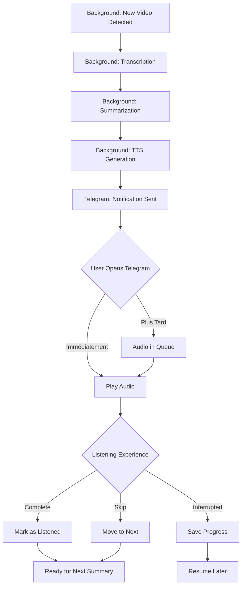
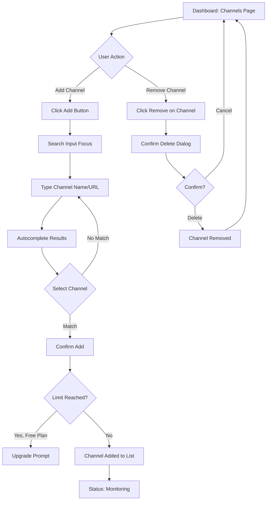

# UX Design Specification BriefTube

**Author:** vin
**Date:** 2026-02-18

---

<!-- UX design content will be appended sequentially through collaborative workflow steps -->

## Executive Summary

### Project Vision

BriefTube transforme la surcharge d'informations YouTube en savoir accessible grâce à l'automatisation intelligente. La plateforme surveille automatiquement les chaînes YouTube abonnées (50-200+ chaînes), génère des résumés audio via IA, et les livre directement sur Telegram. Ce qui commence comme un outil de productivité personnel (gain de 2-3h/jour) évolue vers une plateforme communautaire où les utilisateurs créent et partagent des playlists curées, transformant la consommation passive en découverte active de savoir.

**Proposition de Valeur UX:** Zéro friction après configuration initiale. L'utilisateur s'abonne à ses chaînes une fois, puis reçoit automatiquement des résumés audio qu'il peut écouter partout (sport, déplacements, tâches quotidiennes) via Telegram.

### Target Users

**Primary User: "Information Junkie"**
- Professionnel actif ou passionné multi-intérêts
- 50-200+ chaînes YouTube abonnées
- Utilise Telegram quotidiennement
- Mode de vie actif nécessitant consommation en multitâche
- **UX Need:** Interface simple, automatisation totale, audio-first experience

**Secondary User: "Community Curator"**
- Expert dans un domaine spécifique
- Créateur de playlists thématiques
- Partage ses découvertes avec la communauté
- **UX Need:** Outils de curation intuitifs, visibilité de l'impact (followers)

**Device Context:**
- **Primary:** Mobile (Telegram app) pour écoute audio
- **Secondary:** Desktop/Web pour configuration et gestion

**Tech Savviness:** Intermédiaire à avancé (utilisateurs Telegram + YouTube power users)

### Key Design Challenges

**Challenge 1: Onboarding Friction**
- **Problème:** Ajout manuel de 50-200+ chaînes YouTube est fastidieux
- **Impact:** Risque d'abandon avant d'atteindre la valeur
- **UX Goal:** Minimiser la friction, rendre le processus le plus fluide possible
- **Considérations:** Bulk add, recherche intelligente, suggestions, états de progression clairs

**Challenge 2: Time-to-Value (First Summary)**
- **Problème:** Délai entre inscription et premier résumé reçu (traitement vidéo)
- **Impact:** Désengagement potentiel avant le moment "Aha!"
- **UX Goal:** Communiquer clairement l'état du traitement, montrer la valeur pendant l'attente
- **Considérations:** Onboarding éducatif, previews/exemples, feedback visuel du processus

**Challenge 3: Dual Interface (Web Dashboard + Telegram)**
- **Problème:** Expérience principale sur Telegram (hors contrôle direct de l'UI)
- **Impact:** Dashboard web doit être utile sans concurrencer Telegram
- **UX Goal:** Définir clairement les rôles: Dashboard = configuration/monitoring, Telegram = consommation
- **Considérations:** Dashboard léger, focus sur settings et overview, éviter duplication

### Design Opportunities

**Opportunity 1: Audio-First Excellence**
- **Force:** Audio sur Telegram est le cœur de l'expérience
- **UX Potential:** Qualité audio optimale, voix naturelles, structure narrative des résumés
- **Competitive Edge:** Meilleure expérience d'écoute = rétention supérieure

**Opportunity 2: "Set It and Forget It" Magic**
- **Force:** Automatisation complète post-onboarding
- **UX Potential:** Onboarding simple → configuration minimale → magie quotidienne automatique
- **Competitive Edge:** Zéro friction vs solutions manuelles = adoption massive

**Opportunity 3: Community Discovery (Future)**
- **Force:** Playlists communautaires comme Netflix/Spotify
- **UX Potential:** Browsing de playlists, discovery passive, social proof
- **Competitive Edge:** Network effect = barrière à l'entrée pour compétiteurs

---

## Core User Experience

### Defining Experience

**L'Action Core (Cœur du Produit):**

L'expérience centrale de BriefTube est **"Écouter passivement des résumés audio sur Telegram pendant ses activités quotidiennes"**. L'utilisateur ne "fait" presque rien - c'est l'automatisation qui travaille. La valeur se crée dans la **consommation sans effort** de savoir.

**Le Loop Core:**
1. **Configuration initiale** (une seule fois): Ajouter chaînes YouTube + connecter Telegram
2. **Automatisation silencieuse**: Le système surveille, résume, et livre
3. **Consommation passive**: Recevoir résumés audio sur Telegram
4. **Écoute en multitâche**: Consommer pendant sport, déplacements, routines
5. **Apprentissage continu**: Rester informé sans effort conscient

**Philosophie UX:** "Set it and forget it" - Configurez une fois, bénéficiez pour toujours.

### Platform Strategy

**Architecture Dual-Platform:**

**1. Web Dashboard (Configuration & Monitoring)**
- **Rôle:** Centre de contrôle pour setup et overview
- **Devices:** Desktop/Mobile web
- **Fréquence:** Hebdomadaire ou moins (après onboarding initial)
- **Actions principales:**
  - Onboarding: Ajouter/gérer chaînes YouTube
  - Settings: Préférences audio (voix TTS), connexion Telegram
  - Monitoring: État des abonnements, statistiques de base
  - Billing: Gestion plan Free/Pro

**2. Telegram (Consommation)**
- **Rôle:** Interface primaire de consommation de contenu
- **Devices:** Mobile (principalement)
- **Fréquence:** Quotidienne (plusieurs fois/jour)
- **Actions principales:**
  - Recevoir résumés audio automatiquement
  - Écouter les résumés
  - Contrôles audio basiques (play/pause via Telegram)

**Contraintes Techniques:**
- **Primary device:** Mobile (iOS/Android via Telegram)
- **Connectivity:** Requiert connexion pour livraison initiale, puis offline listening
- **Audio quality:** Optimisé pour écoute mobile (clarity > fidelité parfaite)

### Effortless Interactions

**Ce qui DOIT être sans effort:**

**1. Surveillance Automatique des Vidéos**
- ❌ User ne vérifie JAMAIS manuellement les nouvelles vidéos
- ✅ Le système surveille 24/7 automatiquement
- **UX Principle:** "Invisible reliability"

**2. Génération & Livraison des Résumés**
- ❌ User ne demande JAMAIS un résumé manuellement
- ✅ Résumés générés et livrés automatiquement
- **UX Principle:** "Automation over interaction"

**3. Écoute sur Telegram**
- ❌ User ne navigue PAS dans une interface complexe
- ✅ Résumés arrivent comme messages audio Telegram standards
- **UX Principle:** "Native platform behavior"

**4. Gestion des Abonnements**
- ✅ Ajout/suppression de chaînes doit être rapide (< 10 secondes)
- ✅ Recherche de chaînes intelligente (autocomplete, suggestions)
- **UX Principle:** "Quick in, quick out"

**Ce qui peut demander un peu d'effort (acceptable):**
- Onboarding initial (ajout des chaînes) - optimisé dans v2.0
- Configuration préférences (une seule fois)
- Gestion billing (rare)

### Critical Success Moments

**Moment 1: Première Connexion Telegram (Setup Success)**
- **Quand:** Pendant l'onboarding
- **Experience:** Voir confirmation "Telegram connecté ✅" immédiatement
- **Impact:** Confiance que ça va fonctionner
- **UX Focus:** Feedback instantané, message de succès clair

**Moment 2: Premier Résumé Audio Reçu (Value Proof)**
- **Quand:** <24h après ajout première chaîne
- **Experience:** Notification Telegram + audio summary prêt à écouter
- **Impact:** Réalisation "Wow, ça marche vraiment!"
- **UX Focus:** Qualité du premier résumé critique, onboarding qui gère l'attente

**Moment 3: Écoute Pendant Activité (Aha! Moment)**
- **Quand:** Première fois qu'ils écoutent pendant sport/déplacements
- **Experience:** "Je suis en train d'apprendre tout en faisant autre chose"
- **Impact:** Moment "Aha!" - comprennent la vraie valeur
- **UX Focus:** Qualité audio optimale pour multitâche

**Moment 4: Semaine Sans Vidéo Ratée (Retention Lock)**
- **Quand:** Après 7 jours d'utilisation
- **Experience:** Réalisation "J'ai consommé 100+ vidéos sans y penser"
- **Impact:** Formation de l'habitude, rétention long-terme
- **UX Focus:** Statistiques visibles, sentiment d'accomplissement

### Experience Principles

**Principe 1: "Set It and Forget It"**
- Configuration minimale une fois, puis automatisation totale
- L'utilisateur ne doit jamais "penser" à BriefTube au quotidien
- Le produit travaille en arrière-plan, l'utilisateur bénéficie passivement

**Principe 2: "Audio-First, Mobile-Native"**
- L'audio n'est pas une alternative, c'est l'interface principale
- Optimisé pour écoute mobile (clarté, structure narrative)
- Telegram comme canal naturel (pas besoin d'app dédiée)

**Principe 3: "Zero Daily Friction"**
- Aucune action quotidienne requise
- Pas de login/navigation complexe
- Résumés arrivent comme messages standards

**Principe 4: "Progressive Value Reveal"**
- Valeur immédiate (premier résumé) → Valeur hebdomadaire (habitude) → Valeur communautaire (playlists)
- Chaque étape débloque plus de valeur sans complexité additionnelle

**Principe 5: "Quality Over Quantity"**
- Mieux vaut 10 excellents résumés que 100 médiocres
- Qualité audio et pertinence du contenu sont prioritaires
- Success = temps bien investi, pas juste "plus de contenu"

---

## Desired Emotional Response

### Primary Emotional Goals

**1. Calme & Soulagement (Relief)**
- **Feeling:** "Je ne suis plus submergé par la surcharge YouTube"
- **Why:** Le problème core est le stress de l'overload
- **UX Implication:** Interface apaisante, pas de notifications agressives, simplicité visuelle

**2. Empowerment (Pouvoir)**
- **Feeling:** "Je contrôle mon apprentissage sans sacrifier mon temps"
- **Why:** Transformation de passif (subir l'overload) en actif (choisir son savoir)
- **UX Implication:** Dashboard donne sentiment de contrôle, statistiques montrent l'impact

**3. Productivité Efficace**
- **Feeling:** "Je gagne du temps tout en restant informé"
- **Why:** La promesse centrale est le gain de temps (2-3h/jour)
- **UX Implication:** Métriques de temps économisé visibles, feedback de progression

**4. Confiance & Fiabilité**
- **Feeling:** "Je sais que rien n'est raté, le système fonctionne"
- **Why:** L'automatisation doit être invisible mais fiable
- **UX Implication:** Confirmations claires, états transparents, erreurs communiquées proactivement

### Emotional Journey Mapping

**Discovery Phase:**
- **Émotion:** Curiosité + Espoir
- **Pensée:** "Est-ce que ça peut vraiment résoudre mon problème?"
- **UX Focus:** Landing page claire, value prop immédiate, preuves sociales

**Onboarding Phase:**
- **Émotion:** Léger effort + Anticipation
- **Pensée:** "Ça prend du temps mais ça va valoir le coup"
- **UX Focus:** Progression visible, encouragements, gestion de l'attente

**First Summary (Value Proof):**
- **Émotion:** Surprise + Délice
- **Pensée:** "Wow, le résumé est vraiment bon! Ça marche!"
- **UX Focus:** Qualité du premier résumé critique, célébration du milestone

**Daily Use:**
- **Émotion:** Calme + Productivité
- **Pensée:** "C'est devenu naturel, je ne pense même plus à YouTube"
- **UX Focus:** Expérience transparente, zéro friction, qualité constante

**Week 1 Milestone:**
- **Émotion:** Accomplissement + Confiance
- **Pensée:** "J'ai consommé 100+ vidéos sans stress, c'est génial!"
- **UX Focus:** Statistiques visibles, sentiment de progression, validation

**Long-Term:**
- **Émotion:** Habitude + Appartenance (communauté future)
- **Pensée:** "C'est partie de ma vie, je ne peux plus m'en passer"
- **UX Focus:** Engagement communautaire, récompenses sociales

### Micro-Emotions

**Confiance (Trust):**
- **Quand:** Setup initial, première utilisation
- **UX Need:** Confirmations explicites, transparence du processus, communication claire
- **Design:** Messages de succès, statuts en temps réel, pas de "boîte noire"

**Satisfaction (pas Excitation):**
- **Quand:** Usage quotidien
- **UX Need:** Expérience calme et prévisible, pas de surprises
- **Design:** Interface cohérente, comportements attendus, fiabilité

**Délice (Delight):**
- **Quand:** Moments clés (premier résumé, milestone 100 vidéos)
- **UX Need:** Petites célébrations, reconnaissance de progression
- **Design:** Micro-animations subtiles, messages de félicitations, stats impressionnantes

**Efficacité (Productivity):**
- **Quand:** Écoute en multitâche
- **UX Need:** Zéro distraction, clarté audio, structure narrative
- **Design:** Audio optimisé, pas d'UI complexe pendant écoute

### Design Implications

**Pour Créer le Calme:**
- Interface épurée, pas de clutter visuel
- Pas de notifications push agressives
- Couleurs apaisantes (pas de rouge/orange alarmants)
- Espaces blancs généreux

**Pour Créer l'Empowerment:**
- Dashboard avec overview clair des chaînes
- Statistiques de consommation visibles (X vidéos écoutées, Y heures économisées)
- Contrôle granulaire sur préférences

**Pour Créer la Confiance:**
- États de traitement transparents
- Messages de confirmation explicites
- Erreurs communiquées clairement avec solutions
- Pas de "ça se passe dans le backend mystérieux"

**Pour Créer l'Efficacité:**
- Onboarding optimisé (minimal steps)
- Recherche de chaînes rapide (autocomplete)
- Settings organisés logiquement
- Pas de features inutiles qui distraient

### Emotional Design Principles

**Principe 1: "Calm Technology"**
- Le produit reste en arrière-plan
- Pas de demandes d'attention constantes
- Notifications utiles, pas invasives

**Principe 2: "Transparent Automation"**
- L'utilisateur sait ce qui se passe
- Les processus automatiques sont visibles quand nécessaire
- Confiance par transparence

**Principe 3: "Celebrate Progress, Not Noise"**
- Reconnaître les milestones significatifs
- Pas de gamification artificielle
- Valeur réelle > badges virtuels

**Principe 4: "Respectful of Time"**
- Chaque interaction doit avoir un but
- Pas de friction inutile
- L'efficacité est une forme de respect

---

## UX Pattern Analysis & Inspiration

### Inspiring Products Analysis

**1. Telegram (Plateforme de Consommation)**

**Ce qu'ils font bien:**
- **Simplicité native:** Les messages audio sont des citoyens de première classe
- **Offline-first:** Téléchargement automatique, écoute sans connexion
- **Vitesse de lecture:** Controls 1.5x/2x intégrés pour audio
- **Organisation:** Chats épinglés, recherche puissante, archivage simple

**Leçons pour BriefTube:**
- Utiliser les patterns natifs Telegram (pas réinventer)
- Format audio message standard = familiarité immédiate
- Permettre contrôle vitesse (important pour résumés)

---

**2. Spotify/Podcast Apps (Audio Consumption)**

**Ce qu'ils font bien:**
- **Queue management:** File d'attente intelligente, "Up Next"
- **Progress tracking:** Sauvegarde position, reprise automatique
- **Discovery:** Recommandations basées sur écoute
- **Quality settings:** Ajustement qualité audio selon connexion

**Leçons pour BriefTube:**
- Considérer queue de résumés (ordre de priorité?)
- Sauvegarde progression si résumé interrompu (future)
- Discovery patterns pour playlists communautaires (v2.0)

---

**3. Substack/Newsletter Apps (Curated Content Delivery)**

**Ce qu'ils font bien:**
- **Set it and forget it:** S'abonner une fois, recevoir automatiquement
- **Digest format:** Contenu groupé et livré à intervalle fixe
- **Creator spotlight:** Mise en valeur des curateurs
- **Clean reading:** Interface épurée, focus sur contenu

**Leçons pour BriefTube:**
- Modèle subscription-based fonctionne (channels = newsletters)
- Grouping possible (digest quotidien vs livraison immédiate?)
- Spotlight curateurs pour playlists communautaires (v2.0)

---

**4. Pocket/Instapaper (Read-It-Later)**

**Ce qu'ils font bien:**
- **Frictionless save:** Un clic pour ajouter à la queue
- **Background processing:** Conversion/optimisation en arrière-plan
- **Offline access:** Tout disponible hors ligne
- **Progress indicators:** Temps de lecture estimé

**Leçons pour BriefTube:**
- Ajout rapide de chaînes (minimal friction)
- Background processing transparent
- Indicateurs temps d'écoute estimé (ex: "5 min")

### Transferable UX Patterns

**Pattern 1: Native Platform Behavior (Telegram)**
- **Quoi:** Utiliser comportements standards de la plateforme
- **Pourquoi:** Familiarité = zéro courbe d'apprentissage
- **Application BriefTube:** Messages audio Telegram standards, pas d'UI custom complexe

**Pattern 2: Invisible Automation (Pocket/Substack)**
- **Quoi:** Processus en arrière-plan avec états visibles seulement si nécessaire
- **Pourquoi:** Réduit charge cognitive, crée magie
- **Application BriefTube:** Monitoring/génération invisible, seuls résultats visibles

**Pattern 3: Progressive Disclosure (Spotify)**
- **Quoi:** Fonctionnalités simples d'abord, avancées accessibles mais cachées
- **Pourquoi:** Onboarding simple, power users pas frustrés
- **Application BriefTube:** Dashboard simple par défaut, settings avancés dans sous-menu

**Pattern 4: Content-First Design (Substack)**
- **Quoi:** Interface minimale, contenu au centre
- **Pourquoi:** Utilisateurs viennent pour le contenu, pas l'interface
- **Application BriefTube:** Dashboard épuré, focus sur liste chaînes et stats, pas de decoration inutile

**Pattern 5: Status Transparency (All)**
- **Quoi:** États clairs pour processus asynchrones
- **Pourquoi:** Réduit anxiété, crée confiance
- **Application BriefTube:** "Processing...", "Ready", "Delivered" visibles pour rassurer

### Anti-Patterns to Avoid

**Anti-Pattern 1: Over-Gamification**
- **Problème:** Badges/points qui distraient de la vraie valeur
- **Pourquoi éviter:** Utilisateurs viennent pour apprendre, pas pour des badges
- **BriefTube:** Stats réelles (vidéos écoutées) > achievements artificiels

**Anti-Pattern 2: Notification Overload**
- **Problème:** Trop de notifications push pour "engagement"
- **Pourquoi éviter:** Contredit le principe "Calm Technology"
- **BriefTube:** Notifications uniquement pour valeur réelle (nouveau résumé prêt)

**Anti-Pattern 3: Feature Bloat in Dashboard**
- **Problème:** Trop de features/options dans l'interface web
- **Pourquoi éviter:** Dashboard doit rester simple (usage rare)
- **BriefTube:** Focus sur essentials: channels, settings, billing, stats

**Anti-Pattern 4: Complex Onboarding Wizards**
- **Problème:** Multi-step wizards avec trop d'explications
- **Pourquoi éviter:** Friction maximale au pire moment (début)
- **BriefTube:** Onboarding minimal steps, explications contextuelles (pas upfront)

**Anti-Pattern 5: Forced Social Sharing**
- **Problème:** Popups "Share with friends!" après actions
- **Pourquoi éviter:** Irritant, contredit "respect du temps"
- **BriefTube:** Croissance organique > forced virality

### Design Inspiration Strategy

**Ce que nous adoptons directement:**
- **Telegram native patterns** - Messages audio standards, pas d'UI custom
- **Set-and-forget automation** - Model Substack/newsletters appliqué aux chaînes YouTube
- **Content-first design** - Interface minimale, focus sur l'essentiel

**Ce que nous adaptons:**
- **Spotify queue management** → Simplifié pour BriefTube (ordre chronologique par défaut)
- **Pocket save-for-later** → Quick add de chaînes YouTube (frictionless)
- **Newsletter curation model** → Playlists communautaires (v2.0)

**Ce que nous évitons:**
- Gamification artificielle (badges, streaks)
- Notification overload pour engagement
- Feature bloat dans dashboard
- Onboarding wizards complexes
- Forced social sharing

**Notre Différenciation:**
- **Audio-first sur Telegram** (unique combination)
- **Automation totale** (pas de "read-it-later queue" à gérer)
- **Calm technology** (arrière-plan, pas invasif)

---

## Design System Foundation

### Design System Choice

**Système Choisi: TailwindCSS v4 + Shadcn UI**

**Type:** Themeable System avec composants React headless

**Composants:**
- **Shadcn UI** - Bibliothèque de composants React (dans `src/components/ui/`)
- **Radix UI** - Primitives accessibles unstyled (base de Shadcn)
- **Lucide React** - Icons library
- **Custom Components** - Components métier dans `src/components/nowts/`

### Rationale for Selection

**Pourquoi ce système est parfait pour BriefTube:**

**1. Rapidité de Développement**
- Composants pré-construits et accessibles (Shadcn UI)
- Utility-first CSS (TailwindCSS) = styling rapide
- Pas besoin de créer design system from scratch
- **Alignement MVP:** Livrer rapidement sans sacrifier qualité

**2. Flexibilité & Customization**
- Composants copiables dans le codebase (ownership total)
- Themeable via Tailwind config
- Peut être customisé pour branding unique
- **Alignement Long-terme:** Évolution facile vers vision communautaire

**3. Performance & Accessibilité**
- Radix UI garantit accessibilité (ARIA, keyboard nav)
- TailwindCSS v4 optimisé pour performance
- Tree-shaking automatique
- **Alignement Valeurs:** Respectueux de l'utilisateur (perf + a11y)

**4. Developer Experience**
- Documentation excellente (Shadcn + Tailwind)
- Communauté massive = support/examples
- TypeScript-first
- **Alignement Technique:** Match avec stack Next.js/React 19

**5. Mobile-First**
- TailwindCSS breakpoints responsive par défaut
- Composants Shadcn optimisés mobile
- **Alignement Produit:** Primary device est mobile (Telegram)

### Implementation Approach

**Architecture des Composants:**

```
src/components/
├── ui/              # Shadcn UI components (Button, Card, Input, etc.)
├── nowts/           # Custom business components
└── dashboard/       # Feature-specific components
```

**Utilisation:**
- Utiliser composants Shadcn UI (`ui/`) pour building blocks
- Créer composants custom (`nowts/`) pour logique métier
- Composer pour créer features complexes

**Styling Approach:**
- Mobile-first avec breakpoints TailwindCSS
- Utility classes pour layout (`flex gap-4`)
- Shadcn UI pre-styled components comme base
- Custom theming via `tailwind.config.ts`

### Customization Strategy

**Thème BriefTube:**

**Principes Visuels (Alignés avec Emotional Goals):**
- **Calm & Clean:** Interface épurée, espaces blancs généreux
- **No Noise:** Pas d'emojis, pas de gradients (sauf demande)
- **Content-First:** Composants minimaux, focus sur contenu
- **Mobile-Optimized:** Touch-friendly, responsive

**Color Strategy:**
- Couleurs apaisantes (éviter rouge/orange agressifs)
- Contraste suffisant pour lisibilité
- Dark mode support (confort utilisateur)

**Typography:**
- Composants typography partagés (`@/components/nowts/typography.tsx`)
- Lisibilité prioritaire
- Hierarchy claire

**Spacing & Layout:**
- Préférer `flex gap-4` over `space-y-4`
- Composant `Card` pour wrappers stylisés
- Layouts utilitaires pour cohérence

**Composants Custom Nécessaires:**
- Channel card (affichage chaîne YouTube)
- Statistics dashboard widgets
- Onboarding stepper
- Connection status indicators (Telegram)
- Audio player embeds (si nécessaire)

**Adaptation Shadcn UI:**
- Utiliser composants standards (Button, Input, Card, etc.)
- Customiser via Tailwind classes
- Créer variants spécifiques BriefTube si nécessaire
- Maintenir cohérence avec design system

---

## 2. Core User Experience

### 2.1 Defining Experience

**L'Expérience Définissante de BriefTube:**

> **"Recevoir automatiquement des résumés audio de mes chaînes YouTube préférées sur Telegram et les écouter pendant mes activités quotidiennes"**

**Comparaison avec produits connus:**
- **Comme Spotify:** "Découvrir et écouter n'importe quelle chanson instantanément"
  → BriefTube: "Recevoir et écouter n'importe quelle vidéo YouTube instantanément (en résumé)"

- **Comme Substack:** "S'abonner une fois, recevoir automatiquement"
  → BriefTube: "S'abonner aux chaînes une fois, recevoir résumés automatiquement"

**Ce qui rend l'expérience spéciale:**
- **Passivité active:** L'utilisateur ne "fait" rien quotidiennement, mais apprend activement
- **Transformation de format:** Vidéo (demande attention visuelle) → Audio (consommation en multitâche)
- **Automation totale:** Pas de queue à gérer, pas de "read later" qui s'accumule

### 2.2 User Mental Model

**Modèle Mental de l'Utilisateur:**

**Analogie: "Newsletter Audio Personnalisée"**
- Les chaînes YouTube = newsletters auxquelles on s'abonne
- Les nouvelles vidéos = nouveaux articles
- Les résumés audio = digest livré automatiquement
- Telegram = boîte de réception

**Attentes Utilisateur:**

**Setup (Une Seule Fois):**
- "Je choisis mes sources (chaînes YouTube)"
- "Je configure mes préférences (voix, fréquence)"
- "Je connecte mon Telegram"

**Utilisation (Quotidienne):**
- "Les résumés arrivent automatiquement"
- "Je les écoute quand je veux, où je veux"
- "Rien à faire, ça marche tout seul"

**Points de Confusion Potentiels:**
- "Combien de temps avant de recevoir mon premier résumé?"
- "Comment savoir si une chaîne est bien suivie?"
- "Que se passe-t-il si une vidéo ne peut pas être résumée?"
- "Puis-je choisir quelles vidéos recevoir?"

### 2.3 Success Criteria

**Ce qui fait que l'expérience core "marche bien":**

**1. Fiabilité (Trust)**
- ✅ 95%+ de taux de livraison réussie
- ✅ Aucune vidéo ratée des chaînes suivies
- ✅ Résumés livrés dans <24h après publication
- **Feedback:** "Je sais que ça marche, je n'ai plus à vérifier"

**2. Qualité Audio (Usability)**
- ✅ Audio clair et bien structuré (intro → points clés → conclusion)
- ✅ Voix TTS naturelle et agréable
- ✅ Durée optimale (ni trop long, ni trop court)
- **Feedback:** "C'est agréable à écouter, pas robotique"

**3. Vitesse Perçue (Efficiency)**
- ✅ Notifications instantanées quand résumé prêt
- ✅ Lecture audio démarre immédiatement (pas de buffering)
- ✅ Contrôles Telegram réactifs (play/pause/speed)
- **Feedback:** "C'est rapide, pas de friction"

**4. Simplicité (Effortlessness)**
- ✅ Zéro action quotidienne requise
- ✅ Interface Telegram familière (pas d'apprentissage)
- ✅ "Ça marche tout seul"
- **Feedback:** "Je ne pense même plus à YouTube, j'écoute mes résumés"

### 2.4 Novel UX Patterns

**Patterns Établis (Utilisés):**

**Newsletter Model Appliqué à YouTube:**
- Pattern familier: S'abonner à des sources
- Novel twist: Source = chaînes YouTube, format = audio
- **UX Benefit:** Mental model clair, courbe d'apprentissage minimale

**Audio-First on Messaging Platform:**
- Pattern familier: Messages audio sur Telegram
- Novel twist: Contenu généré automatiquement, pas de conversation
- **UX Benefit:** Plateforme native, zéro nouvelle app à apprendre

**Patterns Innovants (Uniques):**

**Automated Content Transformation:**
- **Innovation:** Vidéo YouTube → Résumé audio automatique
- **Challenge UX:** Communiquer la transformation sans montrer le process
- **Approach:** "Magic box" - inputs clairs (chaînes), outputs clairs (audio), middle invisible

**Passive Learning Loop:**
- **Innovation:** Apprentissage sans action consciente quotidienne
- **Challenge UX:** Maintenir engagement sans demander d'actions
- **Approach:** Stats de progression, milestones automatiques, satisfaction passive

### 2.5 Experience Mechanics

**Flow Détaillé de l'Expérience Core:**

**1. Initiation (Setup Initial)**

**Comment l'utilisateur commence:**
- **Trigger:** Inscription sur BriefTube web dashboard
- **Action:** Ajouter chaînes YouTube (via recherche ou URL)
- **Feedback:** Confirmation visuelle "Chaîne ajoutée ✅"
- **État:** Liste de chaînes visible avec statut "Monitoring"

**Dashboard UI Mechanics:**
- Input de recherche avec autocomplete
- Résultats instantanés avec preview (nom chaîne, avatar, nombre d'abonnés)
- Click ou Enter pour ajouter
- Liste mise à jour en temps réel

**2. Configuration (Une Fois)**

**Connexion Telegram:**
- **Trigger:** Bouton "Connecter Telegram" dans dashboard
- **Action:** Suivre instructions (code ou lien)
- **Feedback:** "Telegram connecté ✅" + preview du bot
- **État:** Section Telegram passe de "Not connected" à "Connected"

**Préférences Audio:**
- **Trigger:** Section Settings
- **Options:** Voix TTS (dropdown), vitesse par défaut (slider?)
- **Feedback:** Preview audio avec settings choisis
- **État:** Préférences sauvegardées automatiquement

**3. Interaction (Automatique - Pas d'Action Quotidienne)**

**Background Automation:**
- **Ce qui se passe (invisible):**
  - Système surveille chaînes 24/7
  - Détecte nouvelles vidéos
  - Génère transcription → résumé → audio
  - Livre sur Telegram

**Ce que l'utilisateur voit:**
- Dashboard: Statut "X vidéos en traitement"
- Telegram: Notification "Nouveau résumé prêt!"
- Audio message avec metadata (titre vidéo, chaîne, durée)

**4. Consommation (Action Principale)**

**Écoute sur Telegram:**
- **Trigger:** Notification Telegram ou check du chat BriefTube
- **Action:** Click sur message audio (contrôles natifs Telegram)
- **Feedback:** Lecture commence immédiatement, progress bar
- **Completion:** Audio termine, marqué comme "écouté"

**Contrôles:**
- Play/Pause (Telegram native)
- Vitesse 1x/1.5x/2x (Telegram native)
- Skip forward/backward
- Metadata visible (titre vidéo original, lien vers YouTube)

**5. Monitoring (Optionnel)**

**Dashboard Check (Hebdomadaire):**
- **Trigger:** Curiosité ou vérification
- **What:** Stats visibles (X résumés reçus cette semaine, Y heures économisées)
- **Action:** View stats, gérer chaînes si nécessaire
- **Outcome:** Satisfaction de voir progression

---

## Visual Design Foundation

### Color System

**Stratégie Couleur - "Calm & Focused"**

**Contraintes Existantes (Project Context):**
- ❌ Pas de gradients (sauf demande explicite)
- ❌ Pas de couleurs agressives (rouge/orange alarmants)
- ✅ Couleurs apaisantes alignées avec "Calm Technology"

**Palette Recommandée:**

**Primary Colors (Actions & Focus):**
- **Brand Primary:** Bleu calme ou vert sage (trust, knowledge, calm)
- **Usage:** Boutons CTA, liens, états actifs
- **Rationale:** Couleurs apaisantes qui inspirent confiance

**Semantic Colors:**
- **Success:** Vert doux (confirmations, états réussis)
- **Warning:** Jaune/amber modéré (alertes non-critiques)
- **Error:** Rouge atténué (erreurs, pas agressif)
- **Info:** Bleu clair (informations, tips)

**Neutral Colors:**
- **Background:** Gris très clair / Blanc pur
- **Text:** Gris très foncé (pas noir pur pour confort)
- **Borders:** Gris clair subtil
- **Disabled:** Gris moyen avec opacité

**Dark Mode:**
- Support complet (confort utilisateur)
- Inversions appropriées avec contraste maintenu
- Background sombre doux (pas noir pur)

**Accessibility:**
- Tous les contrastes respectent WCAG AA minimum (4.5:1 pour texte)
- Couleurs pas seules porteuses d'information (icons/labels additionnels)

### Typography System

**Stratégie Typographique - "Readable & Hierarchical"**

**Contraintes Existantes:**
- Composants typography partagés dans `@/components/nowts/typography.tsx`
- Lisibilité prioritaire
- Hierarchy claire

**Type Scale:**

**Headings:**
- **H1:** Grande taille, fort weight (page titles)
- **H2:** Taille moyenne, semi-bold (section headers)
- **H3:** Taille modérée, medium weight (sub-sections)
- **Usage:** Hierarchy claire, pas plus de 3 niveaux visibles simultanément

**Body Text:**
- **Regular:** 16px base (mobile), 16-18px desktop
- **Small:** 14px (metadata, captions)
- **Line Height:** 1.5-1.6 pour confort de lecture

**Rationale:**
- Tailles généreuses pour lisibilité mobile
- Line heights confortables (pas de texte dense)
- Weights variés pour hierarchy

**Font Strategy:**
- System fonts par défaut (performance + familiarité)
- Ou web font optimisée pour lisibilité (à définir)
- Monospace pour code/technical data si nécessaire

### Spacing & Layout Foundation

**Stratégie Espacement - "Generous & Consistent"**

**Système d'Espacement:**

**Base Unit:** 4px (Tailwind standard)

**Scale:**
- `gap-1` = 4px (très serré)
- `gap-2` = 8px (serré)
- `gap-3` = 12px (normal)
- `gap-4` = 16px (confortable) ← **Default recommandé**
- `gap-6` = 24px (spacieux)
- `gap-8` = 32px (très spacieux)

**Patterns d'Utilisation:**
- ✅ Préférer `flex gap-4` over `space-y-4` (Project Context)
- ✅ Vertical spacing: `flex flex-col gap-4`
- ✅ Horizontal spacing: `flex gap-4`
- ✅ Sections: `gap-6` ou `gap-8` pour séparer groupes

**Layout Principles:**

**1. Mobile-First Responsive:**
- Design pour mobile d'abord
- Breakpoints TailwindCSS: `sm:`, `md:`, `lg:`, `xl:`
- Touch-friendly (min 44x44px targets)

**2. Content-First Hierarchy:**
- Contenu principal au centre
- Actions secondaires accessibles mais pas proéminentes
- Navigation minimale (pas de sidebar complexe sur mobile)

**3. Generous White Space:**
- Éviter le clutter visuel
- Espaces blancs généreux entre sections
- Padding confortable dans components (p-4, p-6)

**4. Card-Based Layouts:**
- Utiliser `Card` component (`@/components/ui/card.tsx`)
- Grouper informations reliées dans cards
- Shadow subtile pour profondeur

**Grid System:**
- Tailwind grid utilities (`grid grid-cols-1 md:grid-cols-2`)
- Responsive columns basé sur device
- Gaps consistents (`gap-4`)

### Accessibility Considerations

**Standards:**
- **WCAG AA** minimum (contraste, tailles, keyboard nav)
- **WCAG AAA** pour texte critique si possible

**Color Accessibility:**
- Contraste texte/background: 4.5:1 minimum (AA)
- Ne pas utiliser couleur seule pour information
- Dark mode avec contraste maintenu

**Typography Accessibility:**
- Tailles minimales: 16px body, 14px small
- Line height généreux (1.5+)
- Pas de texte tout caps long (lisibilité réduite)

**Interaction Accessibility:**
- Touch targets: 44x44px minimum
- Keyboard navigation pour tous les contrôles
- Focus states visibles
- Screen reader friendly (ARIA via Radix UI)

**Motion Accessibility:**
- Respecter `prefers-reduced-motion`
- Animations subtiles par défaut
- Pas de motion essentielle à la compréhension

---

## Design Direction Decision

### Design Directions Explored

**Direction Choisie: "Calm Productivity" (Déjà Établie)**

Basé sur les contraintes du Project Context et les objectifs émotionnels, BriefTube suit une direction de design claire et cohérente:

**Caractéristiques Visuelles:**
- **Style:** Minimal, épuré, content-first
- **Mood:** Calme, professionnel, efficient
- **Density:** Aéré avec white space généreux
- **Approach:** Moins c'est plus - focus sur l'essentiel

### Chosen Direction

**"Calm Productivity" - Direction de Design Principale**

**Pilliers Visuels:**

**1. Minimal & Clean**
- Interface épurée sans clutter
- Pas de decorations inutiles
- Focus absolu sur contenu et actions essentielles
- **Alignement:** Principe "Calm Technology"

**2. Content-First Hierarchy**
- Typographie claire et hiérarchie évidente
- Cards pour grouper informations reliées
- Espaces blancs généreux entre sections
- **Alignement:** Principe "Respectful of Time"

**3. Subtle & Professional**
- Pas d'emojis (icônes Lucide à la place)
- Pas de gradients (couleurs solides)
- Animations subtiles si nécessaires
- **Alignement:** Principes "No Noise"

**4. Mobile-First Responsive**
- Layouts qui s'adaptent naturellement
- Touch-friendly (targets 44x44px+)
- Optimisé pour usage mobile principal
- **Alignement:** Platform Strategy (Telegram mobile)

**5. Trust Through Transparency**
- États visibles (processing, ready, delivered)
- Confirmations explicites pour actions importantes
- Erreurs claires avec solutions
- **Alignement:** Objectif émotionnel "Confiance"

### Design Rationale

**Pourquoi Cette Direction:**

**1. Alignement avec Objectifs Émotionnels**
- "Calm & Relief" → Interface épurée, pas de stress visuel
- "Empowerment" → Contrôles clairs, overview transparent
- "Efficiency" → Layouts optimisés, zéro distraction
- "Trust" → Transparence des états, confirmations explicites

**2. Cohérence avec Stack Technique**
- TailwindCSS + Shadcn UI supporte naturellement cette direction
- Composants minimaux et professionnels
- Performance optimale (pas de decorations lourdes)

**3. Différenciation Compétitive**
- Autres apps souvent surchargées et gamifiées
- BriefTube se démarque par sa simplicité intentionnelle
- "Outil professionnel" vs "app de consommation"

**4. Scalabilité Long-Terme**
- Base solide pour features communautaires futures
- Facilite ajout de fonctionnalités sans compromettre simplicité
- Maintenable et évolutive

### Implementation Approach

**Component Strategy:**
- Utiliser Shadcn UI components comme base (Button, Card, Input, etc.)
- Créer custom components dans `src/components/nowts/` pour logique métier
- Composer pour créer features (dashboard, onboarding, settings)

**Visual Consistency:**
- Respecter les constraints du Project Context
- Utiliser typography components partagés
- Patterns d'espacement cohérents (`flex gap-4`)
- Card-based layouts pour grouping

**Color Application:**
- Couleurs primaires pour CTAs importantes
- Neutrals pour la majorité de l'interface
- Semantic colors pour feedback (success/error/warning)
- Dark mode supporté

**Responsive Behavior:**
- Mobile: Single column, stacked layouts
- Tablet: Two columns où approprié
- Desktop: Max-width containers, espaces latéraux généreux
- Breakpoints TailwindCSS standards

---

## User Journey Flows

### Journey 1: Onboarding (First-Time User Experience)

**Objectif:** Transformer un nouveau visiteur en utilisateur qui reçoit son premier résumé audio

**Flow Détaillé:**



**Points Clés du Flow:**
- **Entry:** Landing page avec value prop claire
- **Friction Point:** Ajout manuel de chaînes (pain identifié)
- **Success Moment:** "Telegram connecté ✅"
- **Value Proof:** Premier résumé reçu (<24h)
- **Aha Moment:** Première écoute réussie

**Optimisations:**
- Permettre skip de "add more channels" (minimum 1 chaîne suffit)
- Progress indicator clair (étape 1/3, 2/3, 3/3)
- Explications inline pendant l'attente du premier résumé
- Option "See Example Summary" pendant l'attente

---

### Journey 2: Daily Usage (Core Loop)

**Objectif:** Utilisateur consomme résumés quotidiennement sans friction

**Flow Détaillé:**



**Points Clés du Flow:**
- **Trigger:** Automatique (nouvelle vidéo détectée)
- **User Action:** Minimal (juste click play)
- **Flexibility:** Peut écouter immédiatement ou plus tard
- **Completion:** Tracking pour stats

**Optimisations:**
- Aucune action requise (100% automatique jusqu'à notification)
- Queue naturelle sur Telegram (messages en ordre)
- Resume position si interrompu (future enhancement)

---

### Journey 3: Channel Management

**Objectif:** Ajouter ou retirer chaînes YouTube facilement

**Flow Détaillé:**



**Points Clés du Flow:**
- **Entry:** Dashboard channels page
- **Add:** Recherche avec autocomplete (rapide)
- **Remove:** Confirmation pour éviter accidents
- **Limit:** Plan Free limité, upgrade prompt contextuel

**Optimisations:**
- Autocomplete instantané (<500ms)
- Preview channel info avant ajout
- Bulk add (future): sélection multiple
- Import shortcuts (paste list of URLs - future)

---

### Journey Patterns

**Pattern 1: "Immediate Feedback"**
- Toute action user → confirmation visuelle immédiate
- Exemples: "Channel added ✅", "Telegram connected ✅", "Processing..."
- **Application:** Chaque interaction majeure

**Pattern 2: "Progressive Disclosure"**
- Informations/options révélées au besoin
- Exemples: Settings avancés cachés par défaut, upgrade prompt contextuel
- **Application:** Éviter overwhelm initial

**Pattern 3: "Error Recovery with Guidance"**
- Erreurs montrent le problème + solution
- Exemples: "Channel not found - Try searching by name", "Telegram connection failed - Retry"
- **Application:** Tous les error states

**Pattern 4: "Background Magic, Visible States"**
- Automation invisible, mais états visibles
- Exemples: "X videos processing", "Last summary: 2 hours ago"
- **Application:** Tout processus asynchrone

### Flow Optimization Principles

**1. Minimize Steps to Value**
- Onboarding: 3 steps max jusqu'à "setup complete"
- Add channel: <10 secondes
- Connect Telegram: <1 minute

**2. Clear Progress Indicators**
- Onboarding: Step X/Y visible
- Processing: "Processing video 3/5"
- Multi-step flows: Breadcrumbs ou progress bar

**3. Graceful Error Handling**
- Errors jamais bloquants sans solution
- Retry options toujours disponibles
- Explications claires (pas de codes d'erreur techniques)

**4. Delight at Key Moments**
- First summary delivered: Célébration subtile
- Telegram connected: Animation de succès
- Milestone reached (100 videos): Reconnaissance

---

## Component Strategy

### Design System Components

**Disponibles via Shadcn UI (Base Foundation):**

**Form Components:**
- `Button` - CTAs, actions, navigation
- `Input` - Text inputs, recherche
- `Select` - Dropdowns (voix TTS, settings)
- `Checkbox` / `Switch` - Toggles, préférences
- `Label` - Labels de formulaires

**Layout Components:**
- `Card` - Grouping d'informations (chaînes, stats)
- `Separator` - Dividers entre sections
- `Tabs` - Navigation settings/billing
- `Accordion` - Collapse/expand sections

**Feedback Components:**
- `Dialog` - Confirmations (delete channel)
- `Alert` - Messages importants
- `Toast` / `Sonner` - Notifications temporaires
- `Progress` - Progress bars (onboarding)
- `Skeleton` - Loading states

**Data Display:**
- `Avatar` - Channel avatars, user profile
- `Badge` - Status indicators (Pro, Free)
- `Table` - Lists de données (future: playlists)

**Navigation:**
- `Dropdown Menu` - User menu, actions
- `Popover` - Tooltips, info additionnelle

---

### Custom Components

**Composants Métier BriefTube:**

**1. ChannelCard**
- **Purpose:** Afficher chaîne YouTube abonnée avec actions
- **Content:** Avatar, nom chaîne, nombre d'abonnés, statut monitoring
- **Actions:** Remove button, view details
- **States:** Default, monitoring, error (channel deleted)
- **Variants:** Compact (liste), Expanded (détails)
- **Location:** `src/components/nowts/channel-card.tsx`

**2. OnboardingStepper**
- **Purpose:** Guider utilisateur à travers onboarding multi-step
- **Content:** Step indicators (1/3, 2/3, 3/3), descriptions
- **States:** Current, completed, upcoming
- **Variants:** Horizontal (desktop), Vertical (mobile)
- **Location:** `src/components/dashboard/onboarding-stepper.tsx` ✅ (existe)

**3. TelegramConnectionStatus**
- **Purpose:** Afficher statut connexion Telegram
- **Content:** État (connected/not connected), instructions si non connecté
- **Actions:** Connect button, disconnect, test connection
- **States:** Not connected, connecting, connected, error
- **Location:** `src/components/dashboard/telegram-status.tsx`

**4. StatsDashboardWidget**
- **Purpose:** Afficher métriques clés (vidéos écoutées, temps économisé)
- **Content:** Number stat, label, icon, trend (optional)
- **Variants:** Small (grid 3 cols), Large (featured stat)
- **States:** Loading (skeleton), loaded, empty state
- **Location:** `src/components/dashboard/stats-widget.tsx`

**5. ChannelSearch**
- **Purpose:** Recherche rapide de chaînes YouTube avec autocomplete
- **Content:** Search input, autocomplete results dropdown
- **Actions:** Type to search, select result, add channel
- **States:** Empty, searching (loading), results, no results
- **Location:** `src/components/dashboard/channel-search.tsx`

**6. SummariesFeed**
- **Purpose:** Afficher feed des vidéos traitées/résumés
- **Content:** Liste de vidéos avec thumbnail, titre, chaîne, status
- **States:** Loading, empty, populated, error
- **Location:** `src/components/dashboard/summaries-feed.tsx` ✅ (existe)

**7. ProcessingStatusIndicator**
- **Purpose:** Montrer statut traitement vidéos en cours
- **Content:** "X videos processing", progress indicator
- **States:** Idle, processing, error
- **Location:** `src/components/dashboard/processing-status.tsx`

---

### Component Implementation Strategy

**Approche de Construction:**
- Composer avec Shadcn UI primitives
- Respecter Project Context constraints (no emojis, no gradients)
- Utiliser typography components partagés
- Patterns d'espacement cohérents (`flex gap-4`)
- Accessibility first (WCAG AA via Radix UI)
- Mobile-first responsive

---

### Implementation Roadmap

**Phase 1 - MVP Core (Priorité Haute):**
- ✅ `OnboardingStepper` (existe)
- ✅ `SummariesFeed` (existe)
- 🔨 `ChannelCard` (essentiel pour gestion)
- 🔨 `ChannelSearch` (essentiel pour onboarding)
- 🔨 `TelegramConnectionStatus` (essentiel pour setup)

**Phase 2 - Dashboard Enhancement:**
- 🔨 `StatsDashboardWidget` (engagement et retention)
- 🔨 `ProcessingStatusIndicator` (transparence et confiance)

**Phase 3 - Future Features (Post-MVP):**
- 🔮 `PlaylistCard` (playlists communautaires)
- 🔮 `CuratorProfile` (profils curateurs)
- 🔮 `PlaylistBrowser` (discovery communautaire)

---

## UX Consistency Patterns

### Button Hierarchy

**Primary Actions (CTAs Principales):**
- **Visual:** Couleur primary, bold, high contrast
- **Usage:** Une seule par vue (Add Channel, Connect Telegram, Upgrade)
- **Behavior:** Hover state visible, loading state si async
- **Mobile:** Full-width sur mobile, inline sur desktop
- **Example:** "Add Channel", "Connect Telegram", "Upgrade to Pro"

**Secondary Actions:**
- **Visual:** Outline ou ghost variant, moins prominent
- **Usage:** Actions alternatives (Cancel, Back, Skip)
- **Behavior:** Hover subtil, pas de loading state
- **Example:** "Skip for now", "Cancel", "View Details"

**Destructive Actions:**
- **Visual:** Red/destructive variant (atténué, pas agressif)
- **Usage:** Delete, Remove, Disconnect (avec confirmation)
- **Behavior:** Dialog de confirmation requis
- **Example:** "Remove Channel" (avec dialog)

**Icon-Only Actions:**
- **Visual:** Icon button ghost
- **Usage:** Actions contextuelles (settings, more options)
- **Behavior:** Tooltip on hover, aria-label requis
- **Mobile:** Larger touch target (44x44px)

---

### Feedback Patterns

**Success Feedback:**
- **Visual:** Toast notification vert doux, check icon
- **Duration:** 3-5 secondes puis auto-dismiss
- **Content:** Action completed + impact ("Channel added - Now monitoring")
- **Accessibility:** aria-live region

**Error Feedback:**
- **Visual:** Alert component rouge atténué, error icon
- **Duration:** Persistent jusqu'à action user
- **Content:** Problème + solution ("Channel not found - Try searching by name")
- **Accessibility:** Focus sur message, screen reader friendly

**Warning Feedback:**
- **Visual:** Warning banner jaune/amber, warning icon
- **Usage:** Limits approachés, actions réversibles
- **Content:** Warning + conséquence ("1 channel left on Free plan")
- **Example:** Plan limits, quota warnings

**Info Feedback:**
- **Visual:** Info banner bleu clair, info icon
- **Usage:** Tips, explications contextuelles
- **Content:** Information utile non-critique
- **Example:** "Summaries usually arrive within 24h"

**Processing States:**
- **Visual:** Loading spinner ou skeleton, pulse animation
- **Content:** "Processing X videos...", "Connecting..."
- **Behavior:** Non-blocking, peut continuer navigation
- **Example:** Video processing status

---

### Form Patterns

**Validation Strategy:**
- **Timing:** On blur (pas on change pour éviter frustration)
- **Success:** Pas de feedback visuel (silence = succès)
- **Error:** Message en dessous du field, field outline rouge subtil
- **Required Fields:** Asterisk ou (required) label

**Error Display:**
- **Visual:** Texte rouge subtil sous le field
- **Content:** Specific problem + guidance ("Email invalid - Use format: you@example.com")
- **Recovery:** Error disparaît dès que field est corrigé

**Submit Behavior:**
- **Loading:** Button montre loading spinner + disabled
- **Success:** Toast confirmation + redirect ou refresh
- **Error:** Form reste visible, errors affichés, focus sur premier error

**Multi-Step Forms (Onboarding):**
- **Progress:** Step indicator visible (1/3, 2/3, 3/3)
- **Navigation:** Next/Back buttons, can skip optional steps
- **State:** Sauvegarde progress automatique (future)

---

### Navigation Patterns

**Dashboard Navigation:**
- **Structure:** Top nav (mobile: hamburger), sidebar (desktop: optional)
- **Current Page:** Indicator visuel clair
- **Mobile:** Bottom nav ou hamburger menu
- **Persistence:** Navigation state preserved

**Breadcrumbs:**
- **Usage:** Multi-level pages (Settings > Billing > Plan)
- **Behavior:** Click to navigate back
- **Mobile:** Collapse si trop long

**Back Navigation:**
- **Browser Back:** Toujours fonctionnel
- **Custom Back:** Si flow spécial (onboarding)
- **Context:** Preserve scroll position

---

### Empty States

**No Channels Added:**
- **Visual:** Illustration simple (SVG) + texte explicatif
- **Content:** "No channels yet - Add your first YouTube channel to get started"
- **Action:** CTA prominent "Add Channel"
- **Tone:** Encourageant, pas négatif

**No Summaries Yet:**
- **Visual:** Loading animation ou placeholder
- **Content:** "Processing your first video - Summaries usually arrive within 24h"
- **Action:** "View Example Summary" (demo)
- **Tone:** Patient, gérer l'attente

**Search No Results:**
- **Visual:** Search icon + texte
- **Content:** "No channels found - Try a different search term"
- **Action:** Clear search, suggestions
- **Tone:** Helpful, pas bloquant

---

### Loading States

**Page Loading:**
- **Visual:** Skeleton screens (miment layout final)
- **Duration:** Optimisé pour <1 seconde
- **Behavior:** Progressive enhancement (contenu apparaît progressivement)

**Component Loading:**
- **Visual:** Spinner dans le component
- **Fallback:** Skeleton ou previous content
- **Behavior:** Non-blocking pour reste de la page

**Background Processing:**
- **Visual:** Subtle indicator ("X processing" badge)
- **Location:** Top-right dashboard ou dans section relevante
- **Behavior:** Update en temps réel (polling ou websocket)

---

### Modal/Overlay Patterns

**Confirmation Dialogs:**
- **Usage:** Actions destructives (delete, disconnect)
- **Content:** Question claire + conséquences
- **Actions:** Destructive action (red) + Cancel (default focus)
- **Behavior:** Escape key to cancel, click outside to cancel

**Info Modals:**
- **Usage:** Explications détaillées, help content
- **Content:** Titre + texte explicatif + optional CTA
- **Behavior:** Close button visible, escape key works

**Full-Screen Modals:**
- **Usage:** Flows complexes (onboarding, settings)
- **Behavior:** Can navigate within, clear exit

---

## Responsive Design & Accessibility

### Responsive Strategy

**Approche: Mobile-First (Primary Device)**

**Rationale:**
- Primary consumption est sur mobile (Telegram)
- Dashboard web principalement utilisé pour setup (peut être desktop ou mobile)
- TailwindCSS supporte mobile-first nativement

**Strategy par Device:**

**Mobile (320px - 767px) - PRIORITY**
- **Layout:** Single column, stacked
- **Navigation:** Hamburger menu ou bottom nav
- **Touch Targets:** 44x44px minimum
- **Content:** Simplifié, priorité au essentiel
- **Actions:** Full-width buttons pour faciliter tap

**Tablet (768px - 1023px)**
- **Layout:** 2 colonnes où approprié (dashboard stats grid)
- **Navigation:** Peut montrer plus d'options
- **Density:** Information density modérée
- **Actions:** Inline buttons acceptable

**Desktop (1024px+)**
- **Layout:** Multi-colonnes, max-width containers (éviter full-width)
- **Navigation:** Sidebar optionnelle ou top nav
- **Density:** Plus d'informations visibles simultanément
- **White Space:** Marges latérales généreuses

**Adaptive Components:**
- **ChannelCard:** Compact liste (mobile) → Expanded avec plus d'info (desktop)
- **Stats:** Grid 1-col (mobile) → 3-col (desktop)
- **Navigation:** Bottom nav (mobile) → Top nav (desktop)
- **Forms:** Full-width (mobile) → Max-width centered (desktop)

---

### Breakpoint Strategy

**TailwindCSS Breakpoints (Standard):**

```css
/* Mobile-first approach */
sm: 640px   /* Tablet portrait */
md: 768px   /* Tablet landscape */
lg: 1024px  /* Desktop */
xl: 1280px  /* Large desktop */
2xl: 1536px /* Extra large */
```

**BriefTube Usage:**
- **Default (< 640px):** Mobile layout
- **sm (640px+):** Tablet adjustments
- **md (768px+):** Desktop multi-column
- **lg (1024px+):** Full desktop experience
- **xl/2xl:** Max-width containers, pas de changements majeurs

---

### Accessibility Strategy

**Compliance Target: WCAG AA (Industry Standard)**

**Accessibility Requirements:**

**1. Perceivable**
- Color contrast: 4.5:1 minimum pour texte
- Alternative text pour toutes images/icons
- Layouts fonctionnent à 200% zoom

**2. Operable**
- Keyboard navigation complète
- Touch targets: 44x44px minimum
- Focus indicators visibles
- Pas de keyboard traps

**3. Understandable**
- Langage clair (français, pas de jargon)
- Comportements predictibles
- Erreurs explicites avec solutions
- Confirmations pour actions destructives

**4. Robust**
- Semantic HTML (nav, main, button vs div)
- ARIA attributes via Radix UI
- Screen reader support

---

### Testing Strategy

**Responsive Testing:**
- Devices: iPhone, Android, iPad, Desktop browsers
- Viewports: 320px, 375px, 768px, 1024px, 1920px
- Tools: DevTools, BrowserStack, Playwright viewports

**Accessibility Testing:**
- Automated: Lighthouse, axe DevTools, Pa11y CI
- Manual: Keyboard-only, Screen readers (VoiceOver, NVDA), Color blindness sims
- User testing: Include users with disabilities

---

### Implementation Guidelines

**Responsive Development:**
- Mobile-first media queries
- Relative units (rem, %)
- `max-w-*` pour desktop
- Responsive images via `next/image`

**Accessibility Development:**
- Semantic HTML structure
- ARIA labels via Radix UI
- Keyboard navigation
- Focus management
- `prefers-reduced-motion` support

---

**Le BMad Master a défini l'expérience utilisateur core complète.**

---

### **📋 Sélectionnez une Option:**

**[A]** Advanced Elicitation - Raffiner l'expérience core
**[P]** Party Mode - Perspectives multiples sur l'expérience
**[C]** Continuer - Sauvegarder et passer à la réponse émotionnelle

**Quelle option, vin?**
